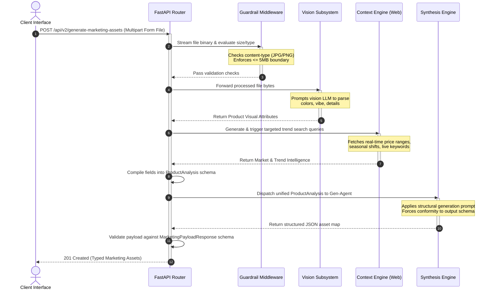

## 📄 Section 2: System Architecture & Dataflow Design

This section details how **Market-Scout-V2** transitions from an abstract conceptual pipeline into a concrete, decoupled software system. The orchestration logic relies on a strictly sequenced data flow, ensuring that asynchronous operations execute predictably before the final payload validation occurs.

---

### 2.1 Component Interaction Topology

The application is split into four isolated modules to ensure ease of testing, simple maintenance, and the ability to update models without modifying the routing layer:

1. **API Ingress & Guardrail Layer:** The gatekeeper built on **FastAPI**. It handles payload termination, security checks, and client response formatting.
2. **Vision Analysis Subsystem:** Interacts with the multi-modal LLM engine to perform unsupervised feature extraction on raw image inputs.
3. **Context Enrichment Engine:** An asynchronous web search abstraction layer that executes target queries, parses search summaries, and isolates dynamic market variables.
4. **Creative Synthesis Engine:** A structural generation block that consumes the unified context matrix and converts it into deterministic object instances.

---

### 2.2 Mermaid Dataflow Diagram

The lifecycle of a single request—from binary multi-part upload to the delivery of the final JSON schema—is visualized in the architectural dataflow below:

---

### 2.3 Structural Orchestration Sequence

The critical phase of the data flow occurs between **Step 6** and **Step 7**. Rather than passing raw strings directly between the AI blocks, the FastAPI orchestrator performs an internal validation check:

* **The Internal Structural Bridge:** The visual output and search results are loaded directly into a Pydantic runtime model (`ProductAnalysis`).
* **Why this matters:** If a web search returns broken data or a vision model fails to return clear tags, the validation step catches it immediately inside the backend. It stops the bad data from reaching the final text generation agent, saving unnecessary API token costs and preventing runtime app crashes.

